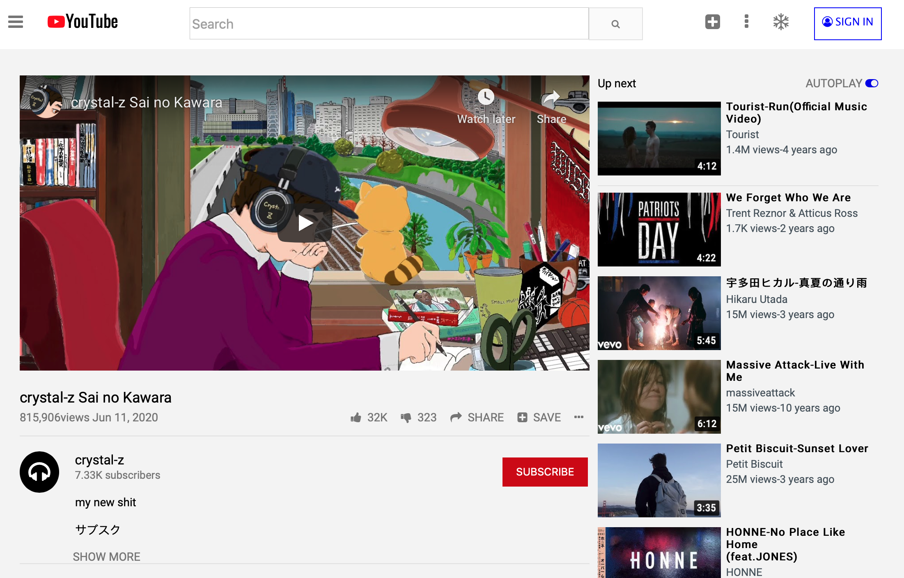

# YouTube clone
Embedding Images and Video
[YouTube Clone](https://hrmtk.github.io/youtube-page/)

## Table of contents
* [General info](#general-info)
* [Technologies](#technologies)
* [Status](#status)
* [Inspiration](#inspiration)

## General info
* Embedding the YouTube video player into page so it actually plays.
* Showing little thumbnail images along the right side.
* Using basic CSS to size and position them appropriately on the page.

## Technologies
* HTML5
* CSS

## Status
Project is: _finished

## Inspiration
[The Odin Project](https://www.theodinproject.com/lessons/embedding-images-and-video)
